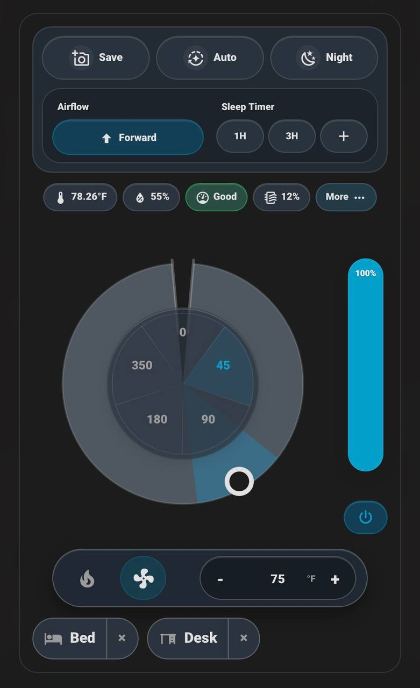

# HA Dyson Card

<p align="center">
  
</p>

[](https://github.com/thanhn062/ha-dyson-card/releases)
[](https://github.com/thanhn062/ha-dyson-card/releases)
[](https://github.com/thanhn062/ha-dyson-card/blob/main/LICENSE)
[](https://www.home-assistant.io/)
[](https://www.hacs.xyz/docs/faq/custom_repositories/)
[](https://github.com/thanhn062/ha-dyson-card/actions/workflows/validate.yaml)
[](https://github.com/cmgrayb/hass-dyson)
[](https://github.com/mefengl/made-by-ai)
[](https://github.com/mefengl/made-by-ai)
[](https://www.buymeacoffee.com/thanhnatos)

A sleek Lovelace dashboard card for Dyson fans exposed through [`hass_dyson`](https://github.com/cmgrayb/hass-dyson).

I built this because I dislike having to open the Dyson app just to make the fan face a certain direction. This card brings that daily control flow into Home Assistant, next to the rest of the dashboard.

This is a frontend card only. It does not replace the Dyson integration; it uses the fan, climate, switch, select, number, and sensor entities already exposed in Home Assistant.

<p align="center">
  
</p>

## Why This Card?

The default Home Assistant entity cards can control a Dyson device, but the experience is scattered across many entities.

HA Dyson Card pulls the useful pieces into one mobile-friendly control surface: direction aiming, sweep presets, airflow speed, power, auto/night mode, heat controls, filter life, and air-quality readings.

The goal is simple: make the Dyson feel like a polished Home Assistant appliance control instead of a collection of separate toggles and sensors.

## Highlights

- Fully functional Dyson control surface for the main things you would normally open the Dyson app to do
- Save preset directions with a name and icon, then tap once to aim the fan back there
- Mobile-first layout with direction, sweep, airflow, timer, sensor, filter, heat, and mode controls in one card

## Features

### Controls

- Direction wheel with drag-to-aim control
- Sweep dial presets for direct, 45°, 90°, 180°, and wide sweep
- Direction presets with custom name and MDI icon
- Vertical airflow speed control with power button
- Auto mode, night mode, airflow direction, and sleep timer controls
- Heat, fan-only, and target temperature controls when a climate entity exists
- Optional left or right placement for the airflow speed control

### Live Information

- Compact badges for temperature, humidity, AQI, and filter life
- Expandable air-quality details for AQI, PM2.5, PM10, VOC, and NO2
- AQI color coding when status/value can be mapped
- Same-device entity discovery from the selected Dyson fan entity
- Home Assistant theme-aware light and dark styling

### Direction Presets

Direction presets are for repeatable aiming positions such as `Bed`, `Desk`, or `Door`.

Each preset stores:

- name
- MDI icon
- center direction

Presets are saved in browser `localStorage` under a key scoped to the fan entity:

```text
ha-dyson-card:direction-presets:<fan entity>
```

Direction presets are local to the browser/device. They do not sync automatically across phones, tablets, wall panels, or browsers.

## Requirements

- Home Assistant 2024.8.0 or newer
- [`hass_dyson`](https://github.com/cmgrayb/hass-dyson) installed and configured
- A Dyson `fan.` entity from `hass_dyson`
- Related Dyson entities attached to the same Home Assistant device for the best experience

## HACS Install

Default HACS inclusion is still pending. For now, install it as a custom repository:

1. HACS -> top-right menu -> `Custom repositories`
2. Repository: `https://github.com/thanhn062/ha-dyson-card`
3. Category: `Dashboard`
4. Install `HA Dyson Card`
5. Refresh or reopen Home Assistant so the dashboard resource is loaded

HACS installs dashboard cards under `www/community/` and serves them through `/hacsfiles/`.

## Quick Start

Add the card to a dashboard:

```yaml
type: custom:ha-dyson-card
entity: fan.my_dyson
```

Optional configuration:

```yaml
type: custom:ha-dyson-card
entity: fan.my_dyson
title: Bedroom Dyson
airflow_control_side: right
```

## Configuration

| Option | Type | Default | Description |
| --- | --- | --- | --- |
| `entity` | string | required | Dyson `fan.` entity from `hass_dyson`. |
| `title` | string | empty | Optional card title. Empty titles do not render a header. |
| `airflow_control_side` | `right` or `left` | `right` | Places the vertical airflow speed control on the right or left side. |

## Control Mapping

| Control | Entity or service |
| --- | --- |
| Power | `fan.turn_on`, `fan.turn_off` |
| Auto | `fan.set_preset_mode` |
| Night | same-device night mode `switch.` |
| Airflow direction | `fan.set_direction` |
| Airflow speed | `fan.set_percentage` |
| Sleep timer | `hass_dyson.set_sleep_timer` |
| Direction wheel | `hass_dyson.set_oscillation_angles` or oscillation number entities |
| Sweep dial | oscillation select entity or angle services |
| Heat / Fan only | `climate.set_hvac_mode` |
| Target temperature | `climate.set_temperature` |

## Sensors

The default badge row shows the values most useful at a glance:

| Badge | Meaning |
| --- | --- |
| Temperature | Ambient temperature reported by the Dyson device. |
| Humidity | Ambient relative humidity. |
| AQI | Air Quality Index or category exposed by the integration. |
| Filter life | Remaining HEPA/carbon filter life percentage. |

The `More` section expands air-quality details when matching sensors exist:

| Detail | Meaning |
| --- | --- |
| AQI | Air Quality Index. Higher values or worse categories usually mean poorer air quality. |
| PM2.5 | Fine particulate matter around 2.5 microns. |
| PM10 | Larger particulate matter around 10 microns. |
| VOC | Volatile Organic Compounds from sources like cooking, cleaning products, smoke, or materials. |
| NO2 | Nitrogen dioxide, commonly associated with combustion sources. |

## Model Compatibility

The card adapts to the entities exposed by `hass_dyson`; it is not hard-coded to one Dyson model.

- Purifier-only models can use fan, speed, direction, sweep, sensor, filter, auto, and night controls when those entities exist.
- Heater models can also show heat, fan-only, and target temperature controls when a climate entity exists.
- Models without reverse airflow, heat, sleep timer, or specific air-quality sensors will have those controls hidden or disabled.

## Manual Install

Download `ha-dyson-card.js` and place it in:

```text
config/www/community/ha-dyson-card/ha-dyson-card.js
```

Then add this dashboard resource:

```text
/local/community/ha-dyson-card/ha-dyson-card.js
```

Resource type:

```text
JavaScript module
```

## Troubleshooting

### The card does not appear in the card picker

Refresh or reopen Home Assistant after installing the dashboard resource. If it still does not appear, use a Manual card with `type: custom:ha-dyson-card`.

### HACS installed it, but the browser still shows an old version

Hard refresh the Home Assistant frontend. If you manually edited the file under `www/community`, remove the generated `.gz` copy so Home Assistant serves the updated JavaScript.

### Controls are missing

Check that the missing feature is exposed by `hass_dyson` as an entity or supported fan/climate feature. The card hides or disables controls that cannot be safely mapped.

### Direction or sweep behaves differently than expected

Dyson models and `hass_dyson` entity sets vary. The card prefers same-device oscillation select/number entities when available and falls back to `hass_dyson.set_oscillation_angles` for angle commands.

## Development

Run the syntax check locally:

```bash
node --check ha-dyson-card.js
```

The GitHub workflow runs:

- HACS plugin validation
- JavaScript syntax validation on Node 24

## Credits

- Built for [`hass_dyson`](https://github.com/cmgrayb/hass-dyson)
- Distributed as a HACS Dashboard/plugin repository

## Disclaimer

This project was built with Codex, with me serving as project manager and overseeing the direction, review, and iteration process throughout.

## License

Apache-2.0
