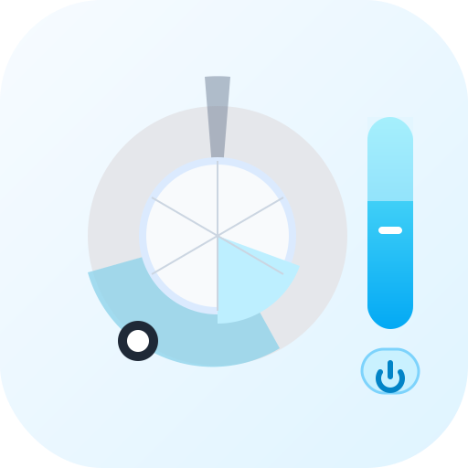

# HA Dyson Card

<p align="center">
  
</p>

<p align="center">
  <a href="https://github.com/thanhn062/ha-dyson-card/releases"></a>
  <a href="https://github.com/thanhn062/ha-dyson-card/releases"></a>
  <a href="https://github.com/thanhn062/ha-dyson-card/actions/workflows/validate.yaml"></a>
  <a href="https://www.hacs.xyz/docs/use/repositories/type/dashboard/"></a>
  <a href="https://www.home-assistant.io/"></a>
  <a href="https://github.com/cmgrayb/hass-dyson"></a>
  <a href="https://github.com/thanhn062/ha-dyson-card/blob/main/LICENSE"></a>
  
  
</p>

`HA Dyson Card` is a standalone Lovelace dashboard card for Dyson fans, purifiers, humidifiers, and heater fans exposed through [`hass_dyson`](https://github.com/cmgrayb/hass-dyson).

This repository contains only the frontend dashboard card. It does not replace the Dyson integration; it uses the fan, climate, switch, select, number, and sensor entities that `hass_dyson` exposes in Home Assistant.

## Highlights

- Direction wheel with drag-to-aim control
- Sweep dial presets for direct, 45°, 90°, 180°, and wide sweep
- Saved direction presets with icon, name, and direction
- Compact top sensor badges for temperature, humidity, AQI, and filter life
- Expandable air-quality details for AQI, PM2.5, PM10, VOC, and NO2 when available
- Auto, night mode, airflow direction, sleep timer, fan speed, power, heat, fan-only, and target temperature controls
- Companion entity discovery from the selected Dyson fan entity
- Home Assistant theme-aware light and dark styling
- HACS Dashboard/plugin repository shape

## Requirements

- Home Assistant 2024.8.0 or newer
- [`hass_dyson`](https://github.com/cmgrayb/hass-dyson) installed and configured
- A Dyson `fan.` entity from that integration
- Related Dyson entities should be attached to the same Home Assistant device as the selected fan

## HACS Install

Default HACS inclusion is pending. For now, add this repository as a custom repository:

1. HACS -> top-right menu -> `Custom repositories`
2. Repository: `https://github.com/thanhn062/ha-dyson-card`
3. Category: `Dashboard`
4. Install `HA Dyson Card`
5. Refresh or reopen Home Assistant so the dashboard resource is loaded

HACS installs dashboard elements under `www/community/` and serves them through `/hacsfiles/`.

## Manual Install

Download `ha-dyson-card.js` and place it in:

```text
config/www/community/ha-dyson-card/ha-dyson-card.js
```

Then add a dashboard resource:

```text
/local/community/ha-dyson-card/ha-dyson-card.js
```

Resource type:

```text
JavaScript module
```

## Quick Start

Add the card to a dashboard:

```yaml
type: custom:ha-dyson-card
entity: fan.my_dyson
```

Optional fields:

```yaml
type: custom:ha-dyson-card
entity: fan.my_dyson
title: Bedroom Dyson
airflow_control_side: right
```

## Configuration

| Option | Type | Required | Default | Description |
| --- | --- | --- | --- | --- |
| `entity` | string | yes | none | Dyson `fan.` entity from `hass_dyson`. |
| `title` | string | no | empty | Optional card title. If empty, no header title is rendered. |
| `airflow_control_side` | `right` or `left` | no | `right` | Places the vertical airflow speed control on the right or left side of the direction wheel. |

## Controls

| Control | Entity or service used | Notes |
| --- | --- | --- |
| Power | `fan.turn_on`, `fan.turn_off` | Uses the configured fan entity. |
| Auto | `fan.set_preset_mode` | Uses `Auto` and `Manual` preset modes when exposed. |
| Night | related `switch.` entity | Looks for a same-device switch named `Night Mode`. |
| Airflow direction | `fan.set_direction` | Toggles forward/reverse when supported by the fan entity. |
| Airflow speed | `fan.set_percentage` | Uses the standard Home Assistant fan percentage service. |
| Sleep timer | `hass_dyson.set_sleep_timer` | Provides 1H, 3H, and custom hour input. |
| Direction wheel | `hass_dyson.set_oscillation_angles` or related number entities | Drag the wheel handle to point the fan. |
| Sweep dial | related oscillation select entity or angle services | Supports direct, 45°, 90°, 180°, and wide sweep when available. |
| Heat / Fan only | `climate.set_hvac_mode` | Appears when a related climate entity exists. |
| Target temperature | `climate.set_temperature` | Uses the related climate entity min/max/step values. |

## Sensor Badges

The top badge row shows the most useful live values in a compact format:

| Badge | Source | Meaning |
| --- | --- | --- |
| Temperature | related temperature sensor | Ambient temperature reported by the Dyson device. |
| Humidity | related humidity sensor | Ambient relative humidity. |
| AQI | related air-quality sensor | Air Quality Index or category exposed by the integration. |
| Filter life | related HEPA/carbon filter sensors | Remaining filter life percentage. |

The `More` button expands a focused air-quality section when matching sensors exist:

| Detail | Meaning |
| --- | --- |
| AQI | Air Quality Index. A higher value or worse category usually means poorer air quality. |
| PM2.5 | Fine particulate matter around 2.5 microns. |
| PM10 | Larger particulate matter around 10 microns. |
| VOC | Volatile Organic Compounds, usually gases and chemical vapors from cooking, cleaning products, smoke, or materials. |
| NO2 | Nitrogen dioxide, commonly associated with combustion sources. |

## Direction Presets

Direction presets let you save repeatable aiming positions such as `Bed`, `Desk`, or `Door`.

Each direction preset stores:

- name
- MDI icon
- center direction

Direction presets are saved in the browser's `localStorage` under a key scoped to the configured fan entity:

```text
ha-dyson-card:direction-presets:<fan entity>
```

Because this is browser-local storage, direction presets persist on the same browser/device but do not automatically sync to other Home Assistant clients. Direction presets save and apply direction only; they do not save or apply sweep or airflow speed.

The direction preset delete flow is confirmation-based: first tap arms the pill as `DELETE`, second tap on the red `DELETE` pill confirms. Tapping elsewhere cancels the armed delete state.

## Entity Discovery

The card starts from the configured `fan.` entity, reads the Home Assistant entity/device registries, and looks for same-device companion entities.

It currently looks for:

- temperature sensor
- humidity sensor
- air-quality sensors
- VOC sensor
- HEPA filter life sensor
- carbon filter life sensor
- night mode switch
- climate entity
- oscillation select entity
- oscillation low/high/center/span number entities

If a model does not expose one of those entities, the related UI control is disabled or hidden.

## Dyson Model Compatibility

The card is designed to adapt to the entities exposed by `hass_dyson`, not to a hard-coded Dyson model list.

That means:

- purifier-only models can still use fan, speed, direction, sweep, sensor, filter, auto, and night controls when those entities exist
- heater models can additionally show heat/fan-only and target temperature controls when a climate entity exists
- models without reverse airflow, heat, sleep timer, or specific air-quality sensors will simply have those controls hidden or disabled

## Troubleshooting

### The card does not appear in the card picker

Refresh or reopen Home Assistant after installing the dashboard resource. If it still does not appear, use a Manual card:

```yaml
type: custom:ha-dyson-card
entity: fan.my_dyson
```

### HACS install works but the browser still shows an old version

Hard refresh the Home Assistant frontend. If you edited the file manually under `www/community`, remove the generated `.gz` copy so Home Assistant/HACS serves the updated JavaScript.

### Controls are missing

Check that the missing feature is exposed by `hass_dyson` as an entity or supported fan/climate feature. The card hides or disables controls that cannot be safely mapped to live Home Assistant entities.

### Direction or sweep behaves differently than expected

Dyson models and `hass_dyson` entity sets vary. The card prefers same-device oscillation select/number entities when available and falls back to `hass_dyson.set_oscillation_angles` for angle commands.

## HACS Repository Shape

This repo follows the HACS Dashboard/plugin shape:

- `ha-dyson-card.js` lives at the repository root
- `hacs.json` declares `filename: ha-dyson-card.js`
- `hacs.json` declares `content_in_root: true`
- `.github/workflows/validate.yaml` runs HACS validation and JavaScript syntax checks
- `CHANGELOG.md` tracks release-facing changes

## Development Checks

Run the syntax check locally:

```bash
node --check ha-dyson-card.js
```

The GitHub workflow also runs:

- HACS plugin validation
- JavaScript syntax validation on Node 24

## Credits

- Built for [`hass_dyson`](https://github.com/cmgrayb/hass-dyson)
- Distributed as a HACS Dashboard/plugin repository

## License

Apache-2.0
